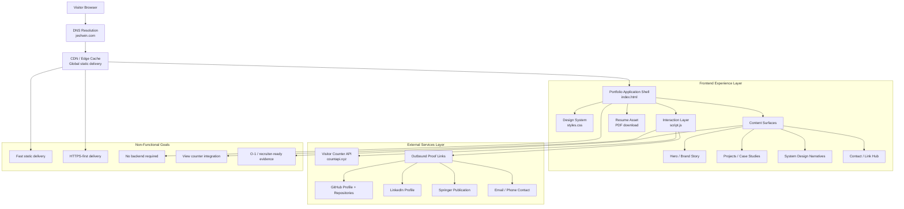
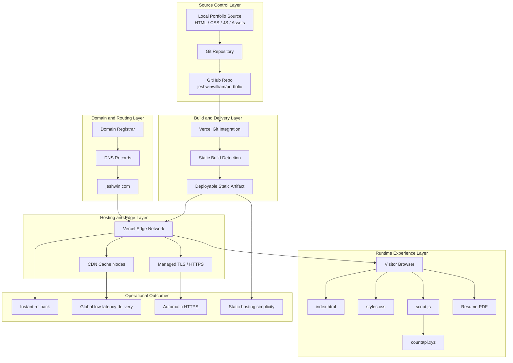

# jeshwin.com

Static personal website for Jeshwin William James.

[](https://jeshwin.com)
[](https://github.com/jeshwinwilliam/portfolio)


## System design



## Deployment architecture



## Architecture notes

- The site is intentionally backend-light so it can deploy fast, stay inexpensive, and remain easy to maintain.
- Static assets are served through an edge network, which improves load time and keeps the experience responsive across regions.
- The external proof system is part of the design: GitHub, LinkedIn, the Springer publication, and the downloadable resume work together as credibility surfaces.
- The only dynamic client-side dependency is the visitor counter, which can later be replaced with first-party analytics or a custom serverless endpoint.
- The deployment model is optimized for portfolio reliability: simple builds, fast rollbacks, HTTPS by default, and clear custom-domain routing.

## Contents

- `index.html`: portfolio structure and content
- `styles.css`: visual system and responsive layout
- `script.js`: lightweight visitor counter integration
- `assets/Jeshwin-William-James-Resume.pdf`: downloadable resume

## Local preview

From this folder:

```bash
python3 -m http.server 8080
```

Then open [http://localhost:8080](http://localhost:8080).

## Visitor counter

The site currently uses `countapi.xyz` in the browser for a no-backend total view counter.
If you prefer a first-party analytics solution later, replace the fetch call in `script.js`.

## Recommended deployment

This is a static site and can be deployed cleanly to:

- Cloudflare Pages
- Netlify
- Vercel
- GitHub Pages

Point the custom domain `jeshwin.com` to the hosting provider and enable HTTPS.
